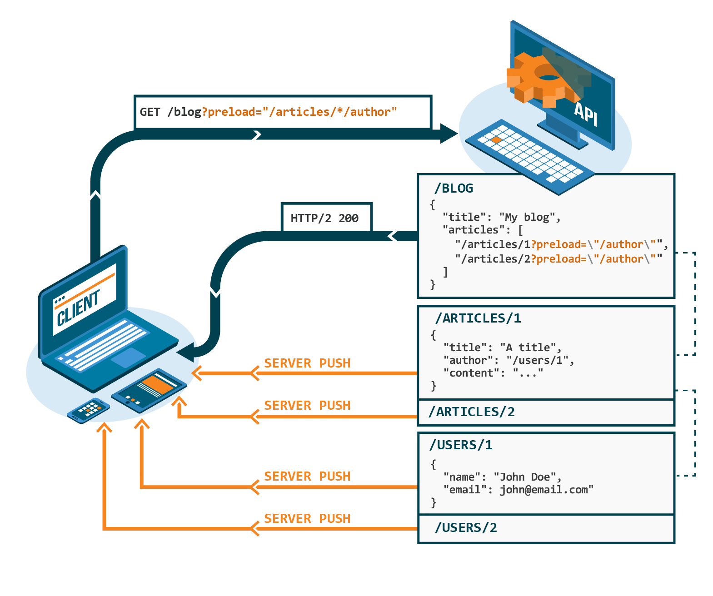
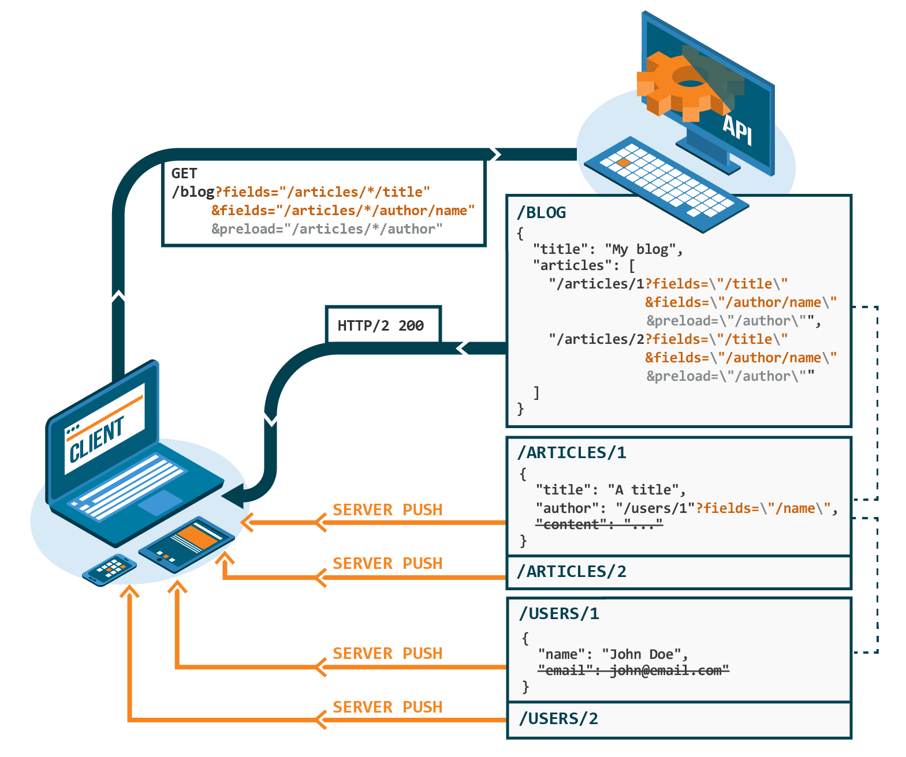

<h1 align="center"></h1>

Vulcain is a brand new protocol using HTTP/2 Server Push to create fast and idiomatic **client-driven REST** APIs.

An open source gateway server which you can put on top of **any existing web API** to instantly turn it into a Vulcain-compatible one is also provided!

It supports [hypermedia APIs](https://restfulapi.net/hateoas/) but also any "legacy" API by documenting its relations [using OpenAPI](docs/gateway/openapi.md).

[](https://godoc.org/github.com/dunglas/vulcain/gateway)
[](https://github.com/dunglas/vulcain/actions)
[](https://codecov.io/gh/dunglas/vulcain)
[](https://goreportcard.com/report/github.com/dunglas/vulcain)


Grab What You Need... Burn The REST!

* [Introduction](#introduction)
  * [Pushing Relations](#pushing-relations)
  * [Filtering Resources](#filtering-resources)
* [Gateway Server](docs/gateway/)
  * [Install](docs/gateway/install.md)
  * [Configuration](docs/gateway/config.md)
  * [Mapping a Non-Hypermedia API using OpenAPI](docs/gateway/openapi.md)
* [Comparison with GraphQL and Other API Formats](docs/graphql.md)
* [Using GraphQL as Query Language for Vulcain](docs/graphql.md#using-graphql-as-query-language-for-vulcain)
* [Demo API](CONTRIBUTING.md)
* [Cache Considerations](docs/cache.md)
* [Formal Specification](spec/vulcain.md)
* [Getting Help](docs/help.md)

The protocol has been published as [an Internet Draft](https://datatracker.ietf.org/doc/draft-dunglas-vulcain/) that [is maintained in this repository](spec/vulcain.md).

A reference, production-grade, implementation [**gateway server**](docs/gateway/install.md) is also available in this repository.
It's free software (AGPL) written in Go. A Docker image is provided.

## Introduction

Over the years, several formats have been created to fix performance bottlenecks impacting web APIs: [over fetching, under fetching](https://stackoverflow.com/a/44568365/1352334), [the n+1 problem](https://restfulapi.net/rest-api-n-1-problem/)...

[Current solutions for these problems (GraphQL, JSON:API's embedded resources and sparse fieldsets, ...)](docs/graphql.md) are smart [network hacks](https://apisyouwonthate.com/blog/lets-stop-building-apis-around-a-network-hack) for HTTP/1. But these hacks come with (too) many drawbacks when it comes to HTTP cache, logs and even security.

Fortunately, thanks to the new features introduced in HTTP/2, it's now possible to create true REST APIs fixing these problems with ease and class! Here comes Vulcain!

See also [the comparison between Vulcain and GraphQL and other API formats](docs/graphql.md).

## Pushing Relations


Considering the following resources:

`/books`

```json
{
    "member": [
        "/books/1",
        "/books/2"
    ]
}
```

`/books/1`

```json
{
    "title": "1984",
    "author": "/authors/1"
}
```

`/books/2`

```json
{
    "title": "Homage to Catalonia",
    "author": "/authors/1"
}
```

`/authors/1`

```json
{
    "givenName": "George",
    "familyName": "Orwell"
}
```

The `Preload` HTTP header introduced by Vulcain can be used to ask the server to immediately push resources related to the requested one using HTTP/2 Server Push:

```http
GET /books/ HTTP/2
Preload: /member/*/author
```

In addition to `/books`, a Vulcain server will use HTTP/2 Server Push to push the `/books/1`, `/books/2` and `/authors/1` resources!

Example in JavaScript:

```javascript
const bookResp = await fetch("/books/1", { headers: { Preload: "/author" } });
const bookJSON = await bookResp.json();

// Returns immediately, the resource has been pushed and is already in the push cache
const authorResp = await fetch(bookJSON.author);
// ...
```

[Full example, including collections](fixtures/static/main.js), see also [use GraphQL as query language for Vulcain](docs/graphql.md#using-graphql-as-query-language-for-vulcain).

Thanks to [HTTP/2 multiplexing](https://stackoverflow.com/a/36519379/1352334), pushed responses will be sent in parallel.

When the client will follow the links and issue a new HTTP request (for instance using `fetch()`), the corresponding response will already be in cache, and will be used instantly!

For non-hypermedia APIs (when the identifier of the related resource is a simple string or int), [use an OpenAPI specification to configure links between resources](docs/gateway/openapi.md).
Tip: the easiest way to create a hypermedia API is to use [the API Platform framework](https://api-platform.com) (by the same author as Vulcain).

[More than 90% of users](https://caniuse.com/#feat=http2) have devices supporting HTTP/2. However, for the remaining 10%, and for cases where using HTTP/2 Server Push isn't allowed such as when resources are [served by different authorities](https://tools.ietf.org/html/rfc7540#section-10.1), Vulcain allows to gracefully fallback to [`preload` links](https://www.w3.org/TR/preload/), which can be used together with [the 103 status code](https://tools.ietf.org/html/rfc8297).

### Query Parameter

Alternatively to HTTP headers, the `preload` query parameter can be used:



## Filtering Resources


The `Fields` HTTP header allows the client to ask the server to return only the specified fields of the requested resource, and of the preloaded related resources.

Multiple `Fields` HTTP headers can be passed. All fields matching at least one of these headers will be returned. Other fields of the resource  will be omitted.

Considering the following resources:

`/books/1`

```json
{
    "title": "1984",
    "genre": "novel",
    "author": "/authors/1"
}
```

`/authors/1`

```json
{
    "givenName": "George",
    "familyName": "Orwell"
}
```

And the following HTTP request:

```http
GET /books/1 HTTP/2
Preload: /author
Fields: /author/familyName
Fields: /genre
```

A Vulcain server will return a response containing the following JSON document:

```json
{
    "genre": "novel",
    "author": "/authors/1"
}
```

It will also push the following filtered `/authors/1` resource:

```json
{
    "familyName": "Orwell"
}
```

### Query Parameter

Alternatively to HTTP headers, the `fields` query parameter can be used to filter resources:



## See Also

* [Mapping a non-hypermedia API using OpenAPI](docs/gateway/openapi.md)
* [Cache considerations](docs/cache.md)
* [Using GraphQL with Vulcain](docs/graphql.md#using-graphql-as-query-language-for-vulcain)
* [Using other selectors such as XPath and CSS selectors for non-JSON documents](spec/vulcain.md#selectors) (only JSON Pointer [is currently supported](https://github.com/dunglas/vulcain/issues/3) by the Gateway Server)

## License and Copyright 

tl;dr:

* proprietary software **can** implement the Vulcain specification
* proprietary software **can** be used behind the Vulcain Gateway Server without having to share their sources
* modifications made to the Vulcain Gateway Server **must** be shared
* alternatively, a commercial license is available for the Vulcain Gateway Server

[The specification](spec/vulcain.md) is available under [the IETF copyright policy](https://trustee.ietf.org/copyright-faq.html). The Vulcain **specification** can be implemented by any software, including proprietary software.

The Vulcain Gateway Server is licensed under [AGPL-3.0](LICENSE). This license implies that if you modify the Vulcain Gateway Server, you must share those modifications. However, the AGPL-3.0 license applies only to the gateway server itself, **not to software used behind the gateway**.

For companies not wanting, or not able to use AGPL-3.0 licensed software, commercial licenses are also available. [Contact us for more information](mailto:kevin+vulcain@dunglas.fr).

## Credits

Created by [Kévin Dunglas](https://dunglas.fr). Sponsored by [Les-Tilleuls.coop](https://les-tilleuls.coop).

Some ideas and code used in Vulcain's reference implementation have been taken from [Hades](https://github.com/gabesullice/hades) by [Gabe Sullice](https://github.com/gabesullice), an HTTP/2 reverse proxy for JSON:API backend.

See also [the prior arts](docs/prior-art.md).
